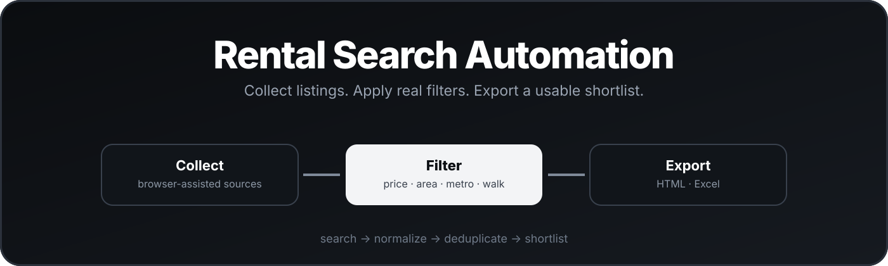

<p align="center">
  
</p>

<div align="center">

# Rental Search Automation

**Browser-assisted rental search with configurable filters, map-aware workflows, resilient source handling, and HTML/Excel exports.**

[](https://github.com/mikhail494/rental-search-automation/actions/workflows/ci.yml)
[](https://github.com/mikhail494/rental-search-automation/releases/latest)


[](LICENSE)

[English](#english) · [Русский](#russian) · [Installation](#installation) · [Configuration](#configuration) · [Usage](#usage)

</div>

<a id="english"></a>

## Features

- Browser-assisted acquisition with persistent local browser sessions.
- Manually assisted login or CAPTCHA interaction when a site requires it. No CAPTCHA bypass is performed.
- Source adapters, multi-page extraction, normalization and monthly-rent validation.
- Filters for price, property type, area, metro station and walking time.
- Deduplication and resilient reporting when one source fails.
- Mobile-friendly standalone HTML reports and Excel export where supported.
- Automated unit tests with fixtures and mocks.

## Architecture

```text
app/services/saved_search.py       saved-search configuration helpers
app/services/source_search.py      source-specific search configuration helpers
app/services/preset_runner.py      generic CLI and report workflow
app/services/browser_source_runner.py  browser-assisted source execution
app/sources/                       source adapters
config/*.example.json              safe public configuration examples
Run Saved Search.cmd               Windows launcher
```

## Installation

Requirements: Python 3.10+, Windows PowerShell for the launcher, and internet access for dependency installation, map tiles and live source access.

```powershell
python -m venv .venv
.\.venv\Scripts\python.exe -m pip install -r requirements.txt
.\.venv\Scripts\python.exe -m playwright install chromium
```

## Configuration

Copy the public examples locally and edit the copies. Local configurations are ignored by Git.

```powershell
Copy-Item config\search_preset.example.json config\search_preset.json
Copy-Item config\source_search.example.json config\source_search.json
```

`search_preset.json` defines property filters, a location-filter mode, stations, walking time, enabled sources and the output directory. `source_search.json` is an optional source-specific public URL configured by the user. Example files contain fictional data only.

## Usage

Run the generic CLI:

```powershell
.\.venv\Scripts\python.exe -m app.services.preset_runner --config config\search_preset.json
```

On Windows, double-click [Run Saved Search.cmd](Run%20Saved%20Search.cmd). It creates or uses `.venv`, installs missing dependencies, installs Playwright Chromium when needed, verifies that the local preset exists, and runs the generic workflow. It pauses only after an error.

The FastAPI interface remains available through:

```powershell
powershell.exe -NoProfile -ExecutionPolicy Bypass -File .\run.ps1
```

## Sources

- **CIAN:** browser-assisted and experimental. External site changes, CAPTCHA, access restrictions or manual interaction can prevent extraction.
- **Yandex Realty:** experimental. Live pages may not expose listing cards and can return a parse error.

## Privacy And Security

- Configure your own saved searches locally; do not commit local configuration files.
- Browser profile data, generated reports, debug output, screenshots and local JSON overrides are ignored by Git.
- Source code stores no credentials, cookies, authorization headers or browser-profile data.
- Public examples never include a calibrated live URL or live listings.

## Tests

```powershell
.\.venv\Scripts\python.exe -m pytest
```

## Limitations

External sites can change without notice. Browser-assisted extraction may require manual interaction, and a source can fail independently without stopping the report from other sources. The workflow does not use proxies, private APIs or CAPTCHA bypasses.

<a id="russian"></a>

# Rental Search Automation

Rental Search Automation — настраиваемый browser-assisted workflow для сбора, нормализации, фильтрации и экспорта объявлений о долгосрочной аренде.

## Возможности

- Получение данных через браузер с постоянной локальной сессией.
- Ручное участие при логине или CAPTCHA. Обход CAPTCHA не выполняется.
- Адаптеры источников, обход нескольких страниц, нормализация и проверка месячной ставки.
- Фильтры по цене, типу жилья, площади, станции метро и времени пешком.
- Дедупликация и устойчивый отчёт, когда один источник недоступен.
- Автономный HTML-отчёт для мобильного просмотра и экспорт Excel, где он поддерживается.
- Автоматические unit-тесты с fixtures и mocks.

## Архитектура

```text
app/services/saved_search.py       работа с сохранённой конфигурацией
app/services/source_search.py      конфигурация поиска для источника
app/services/preset_runner.py      generic CLI и генерация отчёта
app/services/browser_source_runner.py  browser-assisted выполнение источников
app/sources/                       адаптеры источников
config/*.example.json              безопасные публичные примеры
Run Saved Search.cmd               launcher для Windows
```

## Установка

Нужны Python 3.10+, PowerShell в Windows для launcher и интернет для установки зависимостей, карт и живых обращений к источникам.

```powershell
python -m venv .venv
.\.venv\Scripts\python.exe -m pip install -r requirements.txt
.\.venv\Scripts\python.exe -m playwright install chromium
```

## Настройка

Скопируйте публичные примеры локально и отредактируйте копии. Локальные конфигурации исключены из Git.

```powershell
Copy-Item config\search_preset.example.json config\search_preset.json
Copy-Item config\source_search.example.json config\source_search.json
```

`search_preset.json` содержит фильтры жилья, режим фильтрации местоположения, станции, время пешком, источники и папку вывода. `source_search.json` при необходимости содержит публичный URL, настроенный самим пользователем. В примерах только вымышленные данные.

## Использование

Запустите generic CLI:

```powershell
.\.venv\Scripts\python.exe -m app.services.preset_runner --config config\search_preset.json
```

В Windows можно открыть [Run Saved Search.cmd](Run%20Saved%20Search.cmd). Launcher создаёт или использует `.venv`, устанавливает отсутствующие зависимости, при необходимости ставит Playwright Chromium, проверяет наличие локальной конфигурации и запускает workflow. При успешном запуске консоль не задерживается.

Веб-интерфейс FastAPI запускается так:

```powershell
powershell.exe -NoProfile -ExecutionPolicy Bypass -File .\run.ps1
```

## Источники

- **CIAN:** browser-assisted и экспериментальный источник. Изменения сайта, CAPTCHA, ограничения доступа или необходимость ручного действия могут помешать извлечению.
- **Яндекс Недвижимость:** экспериментальный источник. Живые страницы могут не содержать доступных карточек и вернуть ошибку разбора.

## Конфиденциальность И Безопасность

- Настраивайте собственные сохранённые поиски локально и не добавляйте их в Git.
- Профиль браузера, готовые отчёты, debug-данные, скриншоты и локальные JSON-замены игнорируются Git.
- В исходном коде не хранятся учётные данные, cookies, заголовки авторизации или данные профиля браузера.
- Публичные примеры не содержат калиброванный живой URL или реальные объявления.

## Тесты

```powershell
.\.venv\Scripts\python.exe -m pytest
```

## Ограничения

Внешние сайты могут измениться без предупреждения. Browser-assisted извлечение иногда требует ручного действия, а один источник может не сработать независимо от остальных. Workflow не использует прокси, приватные API и обход CAPTCHA.
